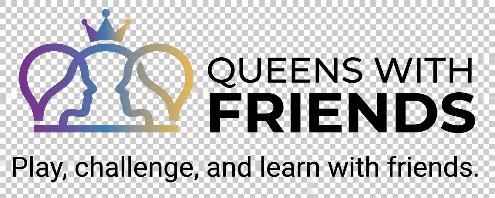

# Queens With Friends ♛
> **Play, challenge, and learn logic with friends.**

**Queens With Friends** is an open-source logic puzzle engine. Unlike competitive leaderboards that can be manipulated by scripts, this platform is a transparent environment for enthusiasts to sharpen their minds, build their own challenges, and learn the deep logic behind every move.

---

### 🚀 Navigation
* [🏁 Quick Start](#-quick-start-i-just-want-to-play)
* [🎮 The Rules](#-the-rules)
* [🛠️ Customizing (Build Tab)](#️-the-build-tab-customize-your-challenge)
* [✉️ Sharing Challenges](#️-sharing-challenges)
* [💡 Learning Logic (Solve Tab)](#-the-solve-tab-learn-the-logic)
* [🛠️ Technical Info](#️-technical-implementation)

---

### ⚠️ Early Release Notice
This is the **first public release** of Queens With Friends. While it has been tested, you may encounter a few bugs as I continue to refine the logic engine and UI.

**Found a bug or have a suggestion?** I'd love to hear from you! Please connect with me and send a message on **[LinkedIn](https://www.linkedin.com/in/rilhia/)**. Your feedback helps make this better for everyone!

---

## 🏁 Quick Start: I Just Want to Play!

When you first load the game, a puzzle is already waiting for you on the **Play** tab.

1.  **Start the Game:** Press the "Start Game" button. A 3-2-1 countdown will begin.
2.  **Marking Blocks (•):** Touch a cell once to mark it as blocked. You can also swipe across several cells.
3.  **Setting a Queen (♛):** Double-tap a cell to place a queen.
4.  **Removing Pieces:** To unblock or remove a queen, simply touch it again.
5.  **Tracking Progress:** Moves are recorded in the activity log below the board.

> ⚠️ **Important:** If you leave the **Play** tab during a game, the board will reset. Finish your solve before switching tabs!

---

## 🎮 The Rules

Place exactly **one queen** in every row, column, and color region. You must satisfy four constraints:

1.  **Row:** Exactly one queen per row.
2.  **Column:** Exactly one queen per column.
3.  **Region:** Exactly one queen per color-coded region.
4.  **Adjacency:** Queens cannot touch each other, not even diagonally.

---

## 🛠️ The Build Tab: Customize Your Challenge
The **Build** tab allows you to load pre-made boards, generate random puzzles, or architect your own.

### 1. Loading Pre-Made Levels

* Select your **Size** (5x5 to 10x10) and **Difficulty**.
* Choose a board from the **Load Board** dropdown.
* Click **Apply to Tabs** to send it to the Play and Solve tabs.

### 2. Generating Random Puzzles
* Select settings and click **Generate Random**. 
* *Note:* 10x10 "Super Hard" boards are complex and may take a moment to compute.
* Click **Test Build** to verify, then **Apply to Tabs**.

### 3. Manual Design (Painting Your Own)

* Flip **Manual Edit** to see the color palette.
* Pick a color and tap cells to "paint" custom regions.
* **Pro Tip:** Tick "Show Solutions" before clicking **Test Build** to see exactly where queens can fit in your custom layout!

---

## ✉️ Sharing Challenges
Once you have a verified board, challenge your friends:

* **The Share Button:** On mobile, opens your sharing options. On desktop, copies a unique URL to your clipboard. The link contains the entire board state!
* **Manual Text Import:** Copy the code block (e.g., `[[0,0...]]`) and send it to a friend to paste into their own Build tab.

---

## 💡 The Solve Tab: Learn the Logic

1.  Apply a board from the Build tab.
2.  Click **Next Step** to watch the engine solve it one move at a time.
3.  **The Reasoning Log:** Explains the "why" behind every move (e.g., Super-Intersections or Mutual Exclusion).

---

## 🛡️ The Mission
This project returns "Queens" to its roots:
1.  **P2P Challenges:** Competition happens via direct links.
2.  **Educational Focus:** The solver teaches you how to think.
3.  **Creative Freedom:** Architect and validate your own logic puzzles.

---

## 🛠️ Technical Implementation
* **Greedy Snakes Algorithm:** Custom procedural generator for organic region growth.
* **Heuristic Deduction Engine:** Multi-layered solver mimicking human logic.
* **Zero-Server P2P:** Board states stored in **Base64 URL Encoding**.

**Built by [Richard Hall](https://www.linkedin.com/in/rilhia/)** | **[MIT License](https://opensource.org/licenses/MIT)**
